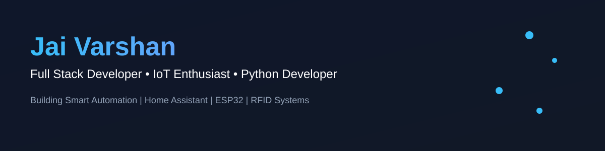

<!-- ========================= HEADER ========================= -->

<!-- 

 -->

<h1 align="center">Hi 👋, I'm Jaivarshan</h1>

<h3 align="center">
Full Stack Developer • IoT Enthusiast • BCA Graduate 🇮🇳
</h3>

---

# 💫 About Me

- 🎓 BCA Graduate
- 💻 Passionate about Full Stack Development & IoT
- 📡 Building Smart Automation Systems using **ESP32**
- 🛒 Developed an **RFID-based Smart Checkout System**
- 🏠 Home Assistant & ESPHome Enthusiast
- 🌱 Currently learning **Docker, Kubernetes, DevOps & Flutter**
- ⚡ I enjoy building real-world software integrated with hardware.

---

# 🛠 Tech Stack

### 🔌 Hardware

---

# 🚀 Featured Projects

### 🛒 SmartCheckout

> RFID-Based Smart Retail Checkout & Inventory Management System

**Tech Stack**

`Python` • `PyQt6` • `MySQL` • `ESP32` • `PN532 RFID`

🔗 https://github.com/jaivarshan7/SmartCheckout

---

### 🎓 TECH BLAZE

Official Symposium Website & Registration Portal

🔗 https://github.com/jaivarshan7/TECH-BLAZE

🔗 https://github.com/jaivarshan7/TECH-BLAZE-Reg

---

### 🏠 Home Automation

Smart Water Tank Automation using

- ESP32
- Ultrasonic Sensor
- Relay Module
- Home Assistant
- ESPHome

---

# 📊 GitHub Statistics

---

# 📈 Contribution Graph

---

# 🌐 Connect With Me

---

# 💭 Quote

> **"Code. Build. Learn. Repeat."**

---

<!-- ========================= END ========================= -->
